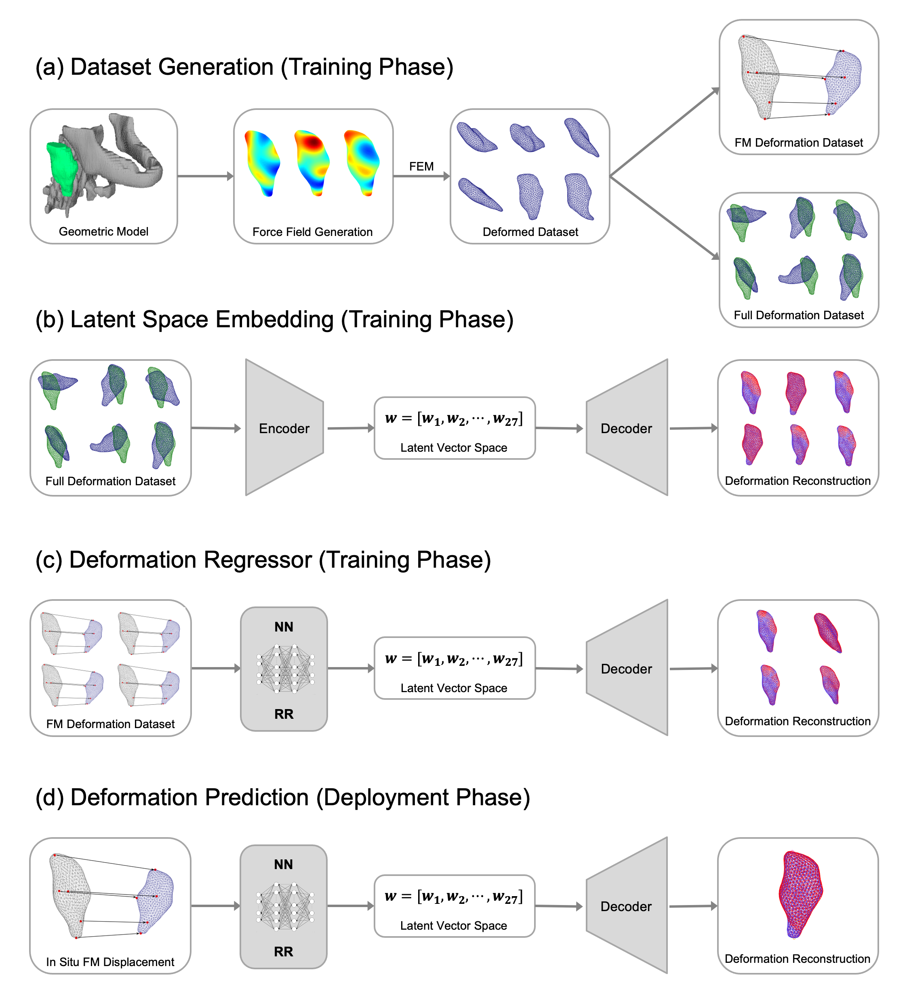

## Overview
This repository contains code to predict soft tissue deformations by tracking the displacement of several fiducial markers. This is accomplished by first simulating various deformations of the surgical region of interest in an offline setting with finite element methods. Next, we train and autoencoder to reduce the dimensionality of the overall deformation field, and use a feed forward neural network to map from the fiducial marker diaplacements to the low dimensional latent space. Finally the latent space is decoded to obtain the models prediction of the entire soft tissue deformation.

  

## Code
There are three examples provided: head and neck tumor, kidney, and aorta. The force fields are generated with the forceInterpolation.py, and FEM simulations are set up within the nonlinearCasesCreation.py files. Note: Ansys is required to run the FEM simulations. Then, the majority of the pipeline is implemented in the ANN_nonlinear_validation.py file. The AE models are trained from within this script, referencing the pipeline in the vae folder. Finally, the NN is trained to map from the FM displacements to the latent space learned by the AE. The ANN_benchmark_results.mat files are output from this script. Note: the head_and_neck.mat file has been omitted as explained below. The ground truth, deformation prediction, and deformation ground truth models can be plotted with visualizeResults.m, and violin plots of the reconstruction errors can be plotted with violinPlot.ipynb.

## Data availability
The head and neck tumor model was generously provided by the Photodynamic Therapy Center, Department of Cell Stress Biology, Roswell Park Comprehensive Cancer Center. However, we cannot redistribute this model and it has therefore been omitted from this repository. Please contact <lkara@cmu.edu> to request a synthetically generated model similar to the head and neck tumor used in this manuscript. The kidney and aorta models are publicly available from the NIH 3D Exchange and can be accessed here: [kidney](https://3d.nih.gov/entries/3DPX-000906), [aorta](https://3d.nih.gov/entries/3DPX-003283). Note: the kidney model was significantly post-processed to obtain a mesh of a single kidney. Furthermore, the ANN_benchmark_results.mat files generated by the ANN_nonlinear_validation.py script are approximately 500MB and cannot be uploaded to Github. These files can be generated by running the ANN_nonlinear_validation.py script for each model, and can also be made available by request.
